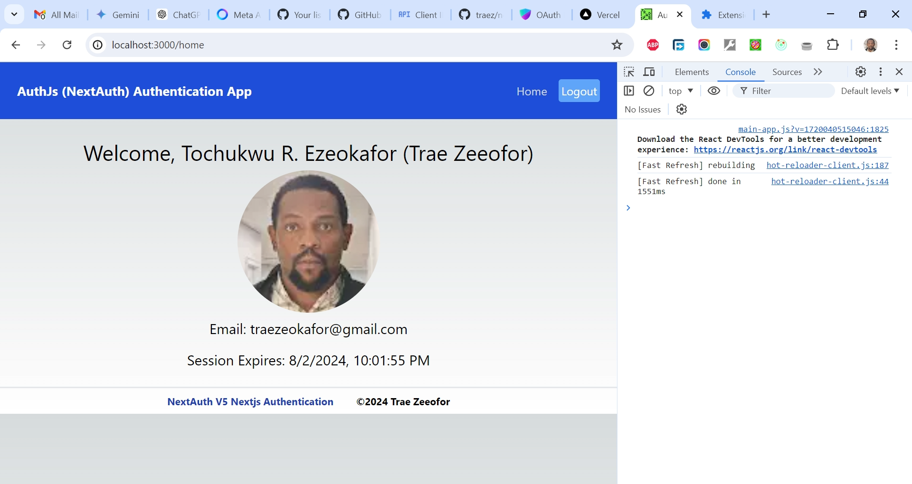

# Auth.js (NextAuth) v5 Next.js Authentication

This is a solution to [Master NextAuth v5: Next.js Authentication Made Easy Project](https://www.youtube.com/watch?v=4BjowsolXmw). I'm practicing and developing my coding competency by building projects after projects.

## Table of contents

- [Overview](#overview)
  - [The challenge](#the-challenge)
  - [Screenshot](#screenshot)
  - [Links](#links)
  - [My process](#my-process)
  - [Built with](#built-with)
  - [What I learned](#what-i-learned)
  - [Continued development](#continued-development)
  - [Useful resources](#useful-resources)
  - [Author](#author)
  - [Acknowledgments](#acknowledgments)

## Overview

### The Challenge/User Stories

Learn the latest version of next-auth v5!

### Screenshot

### Links

- Solution URL: [https://github.com/traez/nextauth-v5-nextjs-authentication](https://github.com/traez/nextauth-v5-nextjs-authentication)
- Live Site URL: [https://nextauth-v5-nextjs-authentication-trae-zeeofors-projects.vercel.app/](https://nextauth-v5-nextjs-authentication-trae-zeeofors-projects.vercel.app/)

## My process

### Built with

- Semantic HTML5 markup
- CSS custom properties
- Flexbox and CSS Grid
- Mobile-first workflow
- [React](https://reactjs.org/) - JS library
- [Next.js](https://nextjs.org/) - React framework
- Tailwind CSS
- Typescript**
- Nodejs (with/without Expressjs)
- MongoDB**  
- GraphQL**    
- Redux Toolkit**  
- Auth.js (NextAuth)   

### What I learned
   
- **Random Base64-Encoded String Generation:**  
`node -e "console.log(require('crypto').randomBytes(32).toString('base64'))"`: This command generates a random base64-encoded string using Node.js's built-in capabilities.  
`npx auth secret`: This command also generates a random base64-encoded string but leverages an external tool (auth).  
Although both commands serve the same purpose, the first approach is more direct and uses Node.js's built-in functionality.
- **auth.ts:**  
This file configures the authentication mechanism, focusing on setting up and configuring the authentication logic using NextAuth. It defines how authentication should work, including the providers, callbacks, and other configuration details. 
- **route.ts (Route Handler):**  
This file sets up the API routes that handle authentication requests using the configured logic. It is responsible for exposing the authentication logic as API routes, using the handlers defined in auth.ts to create actual API endpoints that can be called from the client-side or other parts of the application. 
- **middleware.ts:**  
This file re-exports the auth middleware from auth.ts, enabling it to be used globally across the application to manage session lifetimes. It updates the session expiry time on every request to keep the user logged in for a longer duration. It wraps protected routes with authentication to ensure only authenticated users can access them.  
- **Clerk vs. Auth.js Approach to Authentication:**  
The Clerk approach to authentication simplifies the process by doing most of the heavy lifting, allowing you to easily integrate authentication ("plug and play"). On the other hand, the Auth.js approach requires more groundwork and configuration on your part. As you continue learning, you will explore all the available options to determine the best fit for your needs.  

### Continued development

- More projects; increased competence!

### Useful resources

Stackoverflow  
YouTube  
Google  
ChatGPT

## Author

- Website - [Trae Zeeofor](https://github.com/traez)
- Twitter - [@trae_z](https://twitter.com/trae_z)

## Acknowledgments

-Jehovah that keeps breath in my lungs
